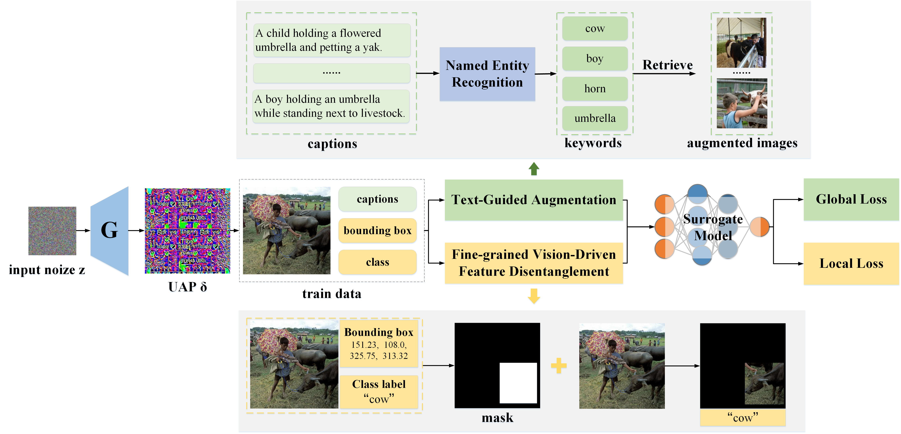

# FGA: FINE-GRAINED ADVERSARIAL ATTACK ON VISION-LANGUAGE MODELS VIA CROSS-MODAL SEMANTIC DECOUPLING
A PyTorch official implementation for [FGA: FINE-GRAINED ADVERSARIAL ATTACK ON VISION-LANGUAGE MODELS VIA CROSS-MODAL SEMANTIC DECOUPLING]

## Visualization


## Setup
### Prepare datasets and models

- Download the datasets [MSCOCO](https://cocodataset.org/#home), and fill the `image_root` in the configuration files.

- Download the checkpoints of the finetuned VLP models: [ALBEF](https://github.com/salesforce/ALBEF), [CLIP](https://huggingface.co/openai/clip-vit-base-patch16), [BLIP](https://github.com/salesforce/BLIP), [X-VLM](https://github.com/zengyan-97/X-VLM)

## Running commands

### Testing
Below we provide running commands for testing our method in Image-Text Retrieval (ITR) task:

```python
python eval.py --config configs/Retrieval_coco_test.yaml --source_model ALBEF  --load_dir $UAP_PATH
```
[Download](https://drive.google.com/drive/folders/1ovueFy4RjKVZdcWbw9NzYlf2aeRbpIGc?usp=sharing) the generators and UAPs.

### Training
The training code will be made publicly available upon acceptance of the accompanying paper.

